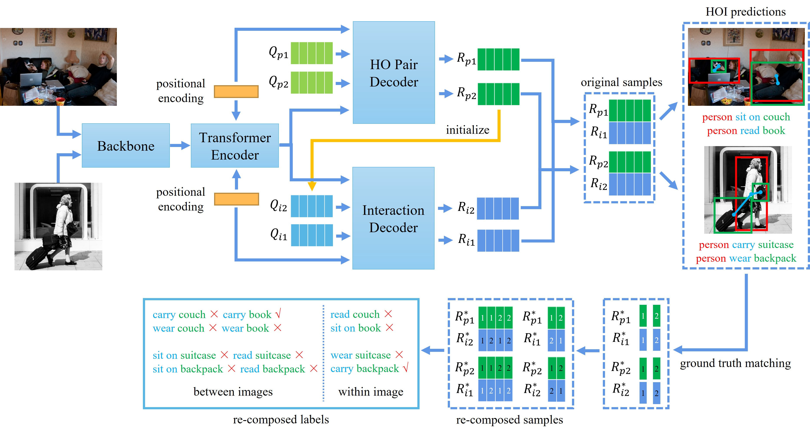

# Compositional Learning in Transformer-Based Human-Object Interaction Detection (ICME 2023)
Code for our ICME 2023 paper "[Compositional Learning in Transformer-Based Human-Object Interaction Detection](https://ieeexplore.ieee.org/document/10219754)".

Developed based on code for "[Mining the Benefits of Two-stage and One-stage HOI Detection](https://arxiv.org/pdf/2108.05077.pdf)" original by Aixi Zhang*, [Yue Liao*](https://liaoyue.net/), [Si Liu](http://colalab.org/people), Miao Lu, Yongliang Wang, Chen Gao and Xiaobo Li.

Contributed by Zikun Zhuang*, Ruihao Qian, Chi Xie and Shuang Liang.


## Installation
Install the dependencies.
```
pip install -r requirements.txt
```

## Data preparation

### HICO-DET
HICO-DET dataset can be downloaded [here](https://drive.google.com/open?id=1QZcJmGVlF9f4h-XLWe9Gkmnmj2z1gSnk). After finishing downloading, unpack the tarball (`hico_20160224_det.tar.gz`) to the `data` directory.

Instead of using the original annotations files, we use the annotation files provided by the PPDM authors. The annotation files can be downloaded from [here](https://drive.google.com/open?id=1WI-gsNLS-t0Kh8TVki1wXqc3y2Ow1f2R). The downloaded annotation files have to be placed as follows.
```
data
 └─ hico_20160224_det
     |─ annotations
     |   |─ trainval_hico.json
     |   |─ test_hico.json
     |   └─ corre_hico.npy
     :
```

### V-COCO
First clone the repository of V-COCO from [here](https://github.com/s-gupta/v-coco), and then follow the instruction to generate the file `instances_vcoco_all_2014.json`. Next, download the prior file `prior.pickle` from [here](https://drive.google.com/drive/folders/10uuzvMUCVVv95-xAZg5KS94QXm7QXZW4). Place the files and make directories as follows.
```
CDN
 |─ data
 │   └─ v-coco
 |       |─ data
 |       |   |─ instances_vcoco_all_2014.json
 |       |   :
 |       |─ prior.pickle
 |       |─ images
 |       |   |─ train2014
 |       |   |   |─ COCO_train2014_000000000009.jpg
 |       |   |   :
 |       |   └─ val2014
 |       |       |─ COCO_val2014_000000000042.jpg
 |       |       :
 |       |─ annotations
 :       :
```
For our implementation, the annotation file have to be converted to the HOIA format. The conversion can be conducted as follows.
```
PYTHONPATH=data/v-coco \
        python convert_vcoco_annotations.py \
        --load_path data/v-coco/data \
        --prior_path data/v-coco/prior.pickle \
        --save_path data/v-coco/annotations
```
Note that only Python2 can be used for this conversion because `vsrl_utils.py` in the v-coco repository shows a error with Python3.

V-COCO annotations with the HOIA format, `corre_vcoco.npy`, `test_vcoco.json`, and `trainval_vcoco.json` will be generated to `annotations` directory.


## Pre-trained DETR parameters
Download the pretrained parameters of DETR detector for [ResNet50](https://dl.fbaipublicfiles.com/detr/detr-r50-e632da11.pth), and put it to the `params` directory.
```
python convert_parameters.py \
        --load_path params/detr-r50-e632da11.pth \
        --save_path params/detr-r50-pre-2stage-q64.pth \
        --num_queries 64

python convert_parameters.py \
        --load_path params/detr-r50-e632da11.pth \
        --save_path params/detr-r50-pre-2stage.pth \
        --dataset vcoco
```

## Training
After the preparation, you can start training with the following commands. The whole training is split into two steps: base model training and dynamic re-weighting training. The trainings of our model based on CDN-S for HICO-DET and V-COCO are shown as follows.

### HICO-DET
```
python -m torch.distributed.launch \
        --nproc_per_node=8 \
        --use_env \
        main.py \
        --pretrained params/detr-r50-pre-2stage-q64.pth \
        --output_dir logs \
        --dataset_file hico \
        --hoi_path data/hico_20160224_det \
        --num_obj_classes 80 \
        --num_verb_classes 117 \
        --backbone resnet50 \
        --num_queries 64 \
        --dec_layers_hopd 3 \
        --dec_layers_interaction 3 \
        --epochs 90 \
        --lr_drop 60 \
        --use_nms_filter \
        --compo \
        --remove \
        --batch_weight_mode 1

python -m torch.distributed.launch \
        --nproc_per_node=8 \
        --use_env \
        main.py \
        --pretrained logs/checkpoint_last.pth \
        --output_dir logs/ \
        --dataset_file hico \
        --hoi_path data/hico_20160224_det \
        --num_obj_classes 80 \
        --num_verb_classes 117 \
        --backbone resnet50 \
        --num_queries 64 \
        --dec_layers_hopd 3 \
        --dec_layers_interaction 3 \
        --epochs 10 \
        --freeze_mode 1 \
        --obj_reweight \
        --verb_reweight \
        --lr 1e-5 \
        --lr_backbone 1e-6 \
        --use_nms_filter \
        --compo \
        --remove \
        --batch_weight_mode 1
```

### V-COCO
```
python -m torch.distributed.launch \
        --nproc_per_node=8 \
        --use_env \
        main.py \
        --pretrained params/detr-r50-pre-2stage.pth \
        --output_dir logs \
        --dataset_file vcoco \
        --hoi_path data/v-coco \
        --num_obj_classes 81 \
        --num_verb_classes 29 \
        --backbone resnet50 \
        --num_queries 100 \
        --dec_layers_hopd 3 \
        --dec_layers_interaction 3 \
        --epochs 90 \
        --lr_drop 60 \
        --use_nms_filter \
        --compo \
        --remove \
        --batch_weight_mode 2

python -m torch.distributed.launch \
        --nproc_per_node=8 \
        --use_env \
        main.py \
        --pretrained logs/checkpoint_last.pth \
        --output_dir logs/ \
        --dataset_file vcoco \
        --hoi_path data/v-coco \
        --num_obj_classes 81 \
        --num_verb_classes 29 \
        --backbone resnet50 \
        --num_queries 100 \
        --dec_layers_hopd 3 \
        --dec_layers_interaction 3 \
        --epochs 10 \
        --freeze_mode 1 \
        --verb_reweight \
        --lr 1e-5 \
        --lr_backbone 1e-6 \
        --use_nms_filter \
        --compo \
        --remove \
        --batch_weight_mode 2
```

## Evaluation

### HICO-DET
You can conduct the evaluation with trained parameters for HICO-DET as follows.
```
python -m torch.distributed.launch \
        --nproc_per_node=8 \
        --use_env \
        main.py \
        --pretrained pretrained/hico_cdn_s.pth \
        --dataset_file hico \
        --hoi_path data/hico_20160224_det \
        --num_obj_classes 80 \
        --num_verb_classes 117 \
        --backbone resnet50 \
        --num_queries 64 \
        --dec_layers_hopd 3 \
        --dec_layers_interaction 3 \
        --eval \
        --use_nms_filter
```

### V-COCO
Firstly, you need the add the following main function to the vsrl_eval.py in data/v-coco.
```
if __name__ == '__main__':
  import sys

  vsrl_annot_file = 'data/vcoco/vcoco_test.json'
  coco_file = 'data/instances_vcoco_all_2014.json'
  split_file = 'data/splits/vcoco_test.ids'

  vcocoeval = VCOCOeval(vsrl_annot_file, coco_file, split_file)

  det_file = sys.argv[1]
  vcocoeval._do_eval(det_file, ovr_thresh=0.5)
```

Next, for the official evaluation of V-COCO, a pickle file of detection results have to be generated. You can generate the file with the following command. and then evaluate it as follows.
```
python generate_vcoco_official.py \
        --param_path pretrained/vcoco_cdn_s.pth \
        --save_path vcoco.pickle \
        --hoi_path data/v-coco \
        --dec_layers_hopd 3 \
        --dec_layers_interaction 3 \
        --use_nms_filter

cd data/v-coco
python vsrl_eval.py vcoco.pickle

```

## Citation
Please consider citing our paper if it helps your research.
```
@INPROCEEDINGS{10219754,
  author={Zhuang, Zikun and Qian, Ruihao and Xie, Chi and Liang, Shuang},
  booktitle={2023 IEEE International Conference on Multimedia and Expo (ICME)}, 
  title={Compositional Learning in Transformer-Based Human-Object Interaction Detection}, 
  year={2023},
  volume={},
  number={},
  pages={1038-1043},
  doi={10.1109/ICME55011.2023.00182}}
```

